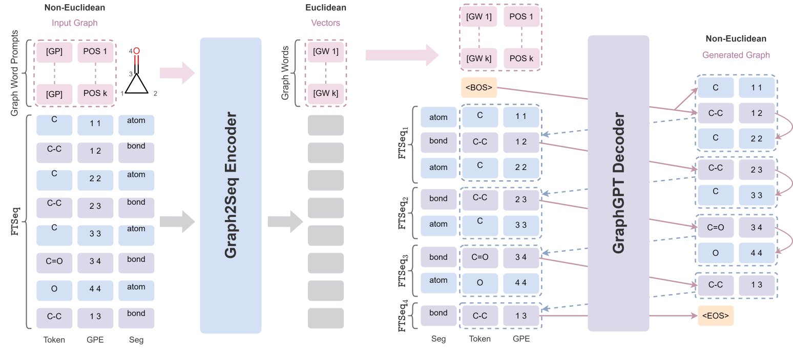

# [GraphsGPT] A Graph is Worth $K$ Words:<br>Euclideanizing Graph using Pure Transformer (ICML2024)

**[Zhangyang Gao](https://scholar.google.com/citations?user=4SclT-QAAAAJ)\*, [Daize Dong](https://daizedong.github.io/)\*, [Cheng Tan](https://chengtan9907.github.io/), [Jun Xia](https://junxia97.github.io/), [Bozhen Hu](https://scholar.google.com/citations?user=6FZh9C8AAAAJ), [Stan Z. Li](https://scholar.google.com/citations?user=Y-nyLGIAAAAJ)**

Published on *The 41st International Conference on Machine Learning (ICML 2024)*.


## Introduction

Can we model Non-Euclidean graphs as pure language or even Euclidean vectors while retaining their inherent information? The Non-Euclidean property have posed a long term challenge in graph modeling. Despite recent graph neural networks and graph transformers efforts encoding graphs as Euclidean vectors, recovering the original graph from vectors remains a challenge.
In this paper, we introduce <span style="color: #315B98;">Graphs</span><span style="color: #7B4399;">GPT</span>, featuring an <span style="color: #315B98;">Graph2Seq</span> encoder that transforms Non-Euclidean graphs into learnable GraphWords in the Euclidean space, along with a <span style="color: #7B4399;">GraphGPT</span> decoder that reconstructs the original graph from GraphWords to ensure information equivalence. We pretrain <span style="color: #315B98;">Graphs</span><span style="color: #7B4399;">GPT</span> on $100$M molecules and yield some interesting findings:

-  The pretrained <span style="color: #315B98;">Graph2Seq</span> excels in graph representation learning, achieving state-of-the-art results on $8/9$ graph classification and regression tasks.
-  The pretrained <span style="color: #7B4399;">GraphGPT</span> serves as a strong graph generator, demonstrated by its strong ability to perform both few-shot and conditional graph generation.
-  <span style="color: #315B98;">Graph2Seq</span>+<span style="color: #7B4399;">GraphGPT</span> enables effective graph mixup in the Euclidean space, overcoming previously known Non-Euclidean challenges.
-  The edge-centric pretraining framework <span style="color: #315B98;">Graphs</span><span style="color: #7B4399;">GPT</span> demonstrates its efficacy in graph domain tasks, excelling in both representation and generation. 



**This is the official code implementation of ICML 2024 paper [A Graph is Worth $K$ Words: Euclideanizing Graph using Pure Transformer](https://arxiv.org/abs/2402.02464).**

The model [checkpoints](https://huggingface.co/collections/DaizeDong/graphsgpt-65efe70c326a1a5bd35c2fcc) can be downloaded from 🤗 Transformers. We provide both the foundational pretrained models with different number of Graph Words $\mathcal{W}$ (GraphsGPT-nW), and the conditional version with one Graph Word (GraphsGPT-1W-C).

| Model Name     | Model Type       | Model Checkpoint                                                                                                                               |
| -------------- |------------------|------------------------------------------------------------------------------------------------------------------------------------------------|
| GraphsGPT-1W   | Foundation Model | <a href="https://huggingface.co/DaizeDong/GraphsGPT-1W"></a>  |
| GraphsGPT-2W   | Foundation Model | <a href="https://huggingface.co/DaizeDong/GraphsGPT-2W"></a>   |
| GraphsGPT-4W   | Foundation Model |<a href="https://huggingface.co/DaizeDong/GraphsGPT-4W"></a>   |
| GraphsGPT-8W   | Foundation Model | <a href="https://huggingface.co/DaizeDong/GraphsGPT-8W"></a>   |
| GraphsGPT-1W-C | Finetuned Model  |<a href="https://huggingface.co/DaizeDong/GraphsGPT-1W-C"></a> |


## Installation

To get started with GraphsGPT, please run the following commands to install the environments.

```bash
git clone git@github.com:A4Bio/GraphsGPT.git --depth=1
cd GraphsGPT
conda create --name graphsgpt python=3.12
conda activate graphsgpt
pip install -e .[dev]
pip install -r requirements.txt
```


## Quick Start

We provide some Jupyter Notebooks in `./jupyter_notebooks`, and their corresponding online Google Colaboratory Notebooks. You can run them for a quick start.

| Example Name                 | Jupyter Notebook                                                          | Google Colaboratory                                                                                                                                                                                            |
|------------------------------|---------------------------------------------------------------------------|----------------------------------------------------------------------------------------------------------------------------------------------------------------------------------------------------------------|
| **GraphsGPT Pipeline**       | [example_pipeline.ipynb](jupyter_notebooks%2Fexample_pipeline.ipynb)      | <a href="https://colab.research.google.com/drive/1BCsdQntGkSAjZgOIH_OQgPBGIMmgeW0d?usp=sharing" target="_parent"></a> |
| Graph Clustering Analysis    | [clustering.ipynb](jupyter_notebooks%2Fanalysis%2Fclustering.ipynb)       | <a href="https://colab.research.google.com/drive/1ghYf4_yuENLNXks-sNEEeiiNxIZpeSVc?usp=sharing" target="_parent"></a> |
| Graph Hybridization Analysis | [hybridization.ipynb](jupyter_notebooks%2Fanalysis%2Fhybridization.ipynb) | <a href="https://colab.research.google.com/drive/10tu2S7DH9qEdAZ6qbtESKHQOq0sfLtdO?usp=sharing" target="_parent"></a> |
| Graph Interpolation Analysis | [interpolation.ipynb](jupyter_notebooks%2Fanalysis%2Finterpolation.ipynb) | <a href="https://colab.research.google.com/drive/14vZ5tX42onQfSRTZXmnLZ36xIKZIgl5G?usp=sharing" target="_parent"></a> |


## Representation

You should first [download](https://github.com/A4Bio/GraphsGPT/releases/tag/data) the configurations and data for finetuning, and put them in `./data_finetune`. (We also include the finetuned checkpoints in the `model_zoom.zip` file for a quick test.)

To evaluate the representation performance of Graph2Seq Encoder, please run:

```bash
bash ./scripts/representation/finetune.sh
```

You can also toggle the `--mixup_strategy` for graph mixup using Graph2Seq.


## Generation

For unconditional generation with GraphGPT Decoder, please refer to [README-Generation-Uncond.md](scripts%2Fgeneration%2Funconditional%2FREADME-Generation-Uncond.md).

For conditional generation with GraphGPT-C Decoder, please refer to [README-Generation-Cond.md](scripts%2Fgeneration%2Fconditional%2FREADME-Generation-Cond.md).

To evaluate the few-shots generation performance of GraphGPT Decoder, please run:

```bash
bash ./scripts/generation/evaluation/moses.sh
bash ./scripts/generation/evaluation/zinc250k.sh
```


## Citation

```latex
@article{gao2024graph,
  title={A Graph is Worth $K$ Words: Euclideanizing Graph using Pure Transformer},
  author={Gao, Zhangyang and Dong, Daize and Tan, Cheng and Xia, Jun and Hu, Bozhen and Li, Stan Z},
  journal={arXiv preprint arXiv:2402.02464},
  year={2024}
}
```

## Contact Us
If you have any questions, please contact:

- Zhangyang Gao: gaozhangyang@westlake.edu.cn

- Daize Dong: dzdong2019@gmail.com
